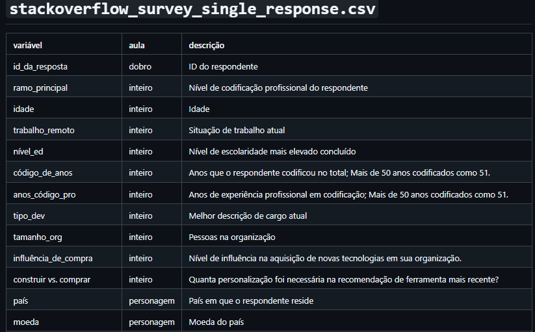
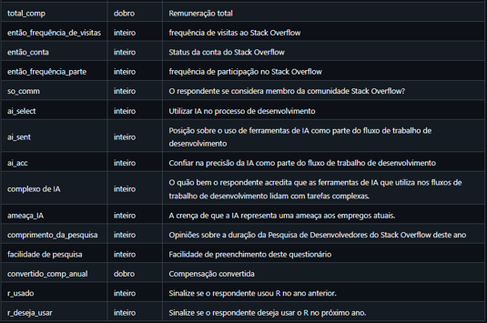

```{r setup}
#| include: false
library(tidyverse)
library(scales)
```

------------------------------------------------------------------------

## Contexto

Este documento acompanha a palestra **Análise e Visualização de Dados**
apresentada na FAM - Centro Universitário das Américas.

O objetivo é demonstrar, com dados reais, como cada etapa de uma
análise - da coleta à visualização - gera valor concreto. Usamos o
**Stack Overflow Developer Survey 2024**, com 65.437 respondentes de 185
países, como dataset-base.

> **Pergunta de negócio:** O que mais impacta o salário de um
> desenvolvedor brasileiro?

## `TidyTuesday`

[{fig-align="center"}](https://github.com/rfordatascience/tidytuesday)

## **Nosso projeto - Stack Overflow Annual Developer Survey 2024**

Os dados foram obtidos da Pesquisa Anual de Desenvolvedores do Stack
Overflow de 2024. Realizada em maio de 2024, a pesquisa coletou
respostas de mais de **65.000** **desenvolvedores** em sete seções
principais:

1.  **Informações básicas**

2.  **Educação, trabalho e carreira**

3.  **Tecnologia e cultura tecnológica**

4.  **Comunidade Stack Overflow**

5.  **Inteligência Artificial (IA)**

6.  **Série para Desenvolvedores Profissionais - Não faz parte da
    pesquisa principal**

7.  **Considerações sobre a pesquisa**

-   O conjunto de dados fornecido para esta análise concentra-se
    exclusivamente nas questões de **resposta única** das seções
    principais da pesquisa.

-   Cada resposta categórica na pesquisa foi codificada com números
    inteiros, com os rótulos correspondentes disponíveis no arquivo de
    correspondência.

> O que você consegue observar sobre o perfil demográfico dos
> desenvolvedores? Como eles interagem com o Stack Overflow? O que eles
> pensam sobre IA?

### Variáveis

{fig-align="center"}

{fig-align="center"}

[**Link**](https://github.com/rfordatascience/tidytuesday/tree/main/data/2024/2024-09-03)
**do repositório do GitHub com os dados.**

## Passo 1 - Carregar e conhecer os dados {#passo-1}

::: callout-note
**Pipeline de análise - Etapa 2: Coleta**

Este passo corresponde ao momento em que o dado chega pela primeira vez
nas suas mãos. Não produzimos o dado — recebemos, inspecionamos e
entendemos sua estrutura. Sem essa leitura inicial, qualquer análise
seguinte é cega.
:::

### O que estamos fazendo

Carregamos os dados via **`tidytuesdayR`** - um pacote R que
disponibiliza datasets públicos semanalmente para prática de
visualização. Em seguida, inspecionamos a estrutura com `glimpse()` e
visualizamos as primeiras linhas com `slice_head()`.

Esta etapa corresponde ao **dicionário de dados**: entender o que cada
coluna representa, quais são os tipos de variáveis e qual é a unidade de
observação.

```{r passo1-carregar}
#install.packages("tidytuesdayR")

tuesdata <- tidytuesdayR::tt_load("2024-09-03")

# Extraindo os três datasets da semana
crosswalk  <- tuesdata$qname_levels_single_response_crosswalk
questions  <- tuesdata$stackoverflow_survey_questions
df_raw     <- tuesdata$stackoverflow_survey_single_response

# Inspecionar estrutura
glimpse(df_raw)
```

```{r passo1-head}
# Primeiras linhas - uma linha por respondente
slice_head(df_raw, n = 5)
```

```{r passo1-resumo}
# Dimensão do dataset
df_raw |>
  summarise(
    respondentes = n(),
    colunas      = ncol(df_raw),
    paises       = n_distinct(country))
```

### Resultado e pontos principais

-   O dataset tem **65.437 linhas** (uma por respondente) e **28
    colunas**.
-   A variável `converted_comp_yearly` contém o salário anual convertido
    para USD - é nossa **variável resposta** (dependente).
-   As variáveis `dev_type`, `ed_level`, `years_code_pro` e `country`
    são nossas **variáveis explicativas** (independentes).
-   `r_used` é uma variável binária (0/1) que indica se o respondente
    usa R.
-   As colunas categóricas estão **codificadas numericamente** -
    precisaremos recodificá-las antes de qualquer visualização.

::: callout-note
**Ponto técnico:** Em qualquer análise, antes de qualquer gráfico ou
modelo, leia o dicionário de dados.
:::

------------------------------------------------------------------------

## Passo 2 - Filtrar, limpar e recodificar {#passo-2}

::: callout-note
**Pipeline de análise - Etapa 3: Limpeza e tratamento**: Esta é a etapa
mais trabalhosa e a mais ignorada. É aqui que 60-70% do tempo real de um
projeto é gasto. **De 1.375 brasileiros na pesquisa**, apenas **672
passaram pelo filtro de qualidade** - metade dos dados foram descartados
antes de começar a análise.
:::

### O que estamos fazendo

**Aplicamos quatro operações essenciais de limpeza em sequência usando o
pipe `|>`:**

1.  **Filtro geográfico:** manter apenas Brasil (`country == "Brazil"`)
2.  **Remoção de missings:** eliminar registros sem salário informado
3.  **Remoção de outliers:** corte em USD 1.000 (mínimo razoável) e USD
    300.000 (limite superior para evitar erros de digitação)
4.  **Recodificação:** substituir os códigos numéricos pelos rótulos da
    pesquisa

```{r passo2-mapas}
# Mapas de rótulos - baseados no questionário oficial do Stack Overflow 2024
ed_level_map <- c(
  "1" = "Sem diploma",
  "2" = "Bacharelado",
  "3" = "Mestrado",
  "4" = "Ensino médio",
  "5" = "Outro pós-grad",
  "6" = "Faculdade incompleta",
  "7" = "Doutorado",
  "8" = "Ed. primária")

dev_type_map <- c(
  "1"  = "Academic researcher",    "2"  = "Cloud infra engineer",
  "3"  = "Data scientist / ML",    "4"  = "Database admin",
  "5"  = "Designer UI/UX",         "6"  = "Desktop/enterprise dev",
  "7"  = "DevOps",                 "8"  = "Educator",
  "9"  = "Embedded dev",           "10" = "Engineering manager",
  "11" = "Front-end dev",          "12" = "Full-stack dev",
  "13" = "Game dev",               "14" = "Mobile dev",
  "15" = "Back-end dev",           "16" = "Student",
  "17" = "QA/test dev",            "18" = "Security professional",
  "19" = "Senior executive",       "20" = "Site reliability engineer",
  "21" = "Sys admin",              "22" = "Blockchain dev",
  "23" = "Dev experience",         "24" = "Dev advocate",
  "25" = "Hardware engineer",      "26" = "Scientist (not CS)",
  "27" = "Marketing/sales",        "28" = "Product manager",
  "29" = "Project manager",        "30" = "Scrum master",
  "31" = "Tech writer",            "32" = "Other",
  "33" = "Learning to code",       "34" = "Data engineer")
```

```{r passo2-limpar}
# Pipeline de limpeza completo
df_br <- df_raw |>
  filter(country == "Brazil") |>
  filter(!is.na(converted_comp_yearly)) |>
  filter(converted_comp_yearly > 1000, converted_comp_yearly < 300000) |>
  mutate(
    ed_level_label = recode(as.character(ed_level), !!!ed_level_map),
    dev_type_label = recode(as.character(dev_type), !!!dev_type_map),
    exp_faixa = cut(
      years_code_pro,
      breaks = c(0, 2, 5, 10, 15, Inf),
      labels = c("0-2 anos", "3-5 anos", "6-10 anos", "11-15 anos", "15+ anos"),
      include.lowest = TRUE))

# Resumo após limpeza - sem $ e sem cat()
df_br |>
  summarise(
    respondentes_brasil  = n(),
    salario_minimo       = min(converted_comp_yearly),
    salario_maximo       = max(converted_comp_yearly),
    mediana              = median(converted_comp_yearly),
    media                = mean(converted_comp_yearly))
```

### Resultado e pontos principais

-   De 1.375 respondentes brasileiros, **672 têm salário válido** após a
    limpeza.
-   A distribuição do salário é **assimétrica à direita**
    (right-skewed): a média é puxada para cima por valores extremos,
    tornando a **mediana** uma medida de tendência central mais
    adequada.
-   O **corte de outliers** é uma decisão analítica - precisa ser
    documentada e justificada. Valores acima de USD 300k no mercado
    brasileiro são provavelmente erros de digitação ou moeda incorreta.
-   A recodificação transforma dado codificado em **dado
    interpretável** - etapa obrigatória antes de qualquer visualização.

::: callout-important
**Ponto técnico - Média × Mediana:** Em distribuições assimétricas, a
média é enganosa. Se 9 pessoas ganham
R$&nbsp;5.000 e 1 ganha R$ 500.000, a média é
R$&nbsp;54.500 - mas não representa ninguém. A mediana seria R$ 5.000,
que representa a realidade da maioria.
:::

------------------------------------------------------------------------

## Passo 3 - Análise univariada: distribuição de salários {#passo-3}

::: callout-note
**Pipeline de análise - Etapa 4: Exploração (EDA) - fase 1**

Antes de cruzar qualquer variável, precisamos entender como o salário se
distribui sozinho - sua forma, seus extremos e sua tendência central. É
a primeira fase da EDA: uma variável de cada vez.
:::

### O que estamos fazendo

Analisamos a **distribuição da variável resposta** isoladamente com um
histograma e curva de densidade. Identificamos forma, assimetria, moda e
posição relativa de média e mediana.

```{r passo3-histograma}
#| fig-cap: "Distribuição de salários anuais - Desenvolvedores brasileiros, Stack Overflow 2024"

# Calcular mediana e média sem $
resumo_br <- df_br |>
  summarise(
    mediana = median(converted_comp_yearly),
    media   = mean(converted_comp_yearly))

mediana_br <- resumo_br |> pull(mediana)
media_br   <- resumo_br |> pull(media)

df_br |>
  ggplot(aes(x = converted_comp_yearly)) +
  geom_histogram(
    aes(y = after_stat(density)),
    bins  = 35,
    fill  = "#0F2D4A",
    color = "white",
    alpha = 0.85) +
  geom_density(color = "#F97316", linewidth = 1.2) +
  geom_vline(
    xintercept = mediana_br,
    color = "#F97316", linetype = "dashed", linewidth = 1) +
  geom_vline(
    xintercept = media_br,
    color = "#94A3B8", linetype = "dotted", linewidth = 1) +
  annotate(
    "label",
    x = mediana_br + 8000, y = Inf,
    label = paste0("Mediana (tracejada)\nUSD ", comma(round(mediana_br))),
    vjust = 1.5, hjust = 0, color = "#F97316", size = 3.5,
    fill = "white", label.size = 0) +
  annotate(
    "label",
    x = media_br + 8000, y = Inf,
    label = paste0("Média (pontilhada)\nUSD ", comma(round(media_br))),
    vjust = 3.8, hjust = 0, color = "#94A3B8", size = 3.5,
    fill = "white", label.size = 0) +
  scale_x_continuous(
    labels = dollar_format(prefix = "USD "),
    limits = c(0, 300000),
    breaks = seq(0, 300000, 50000)) +
  scale_y_continuous(
    labels = label_number(accuracy = 0.00001)) +
  labs(
    title    = "Distribuição de salários anuais - Desenvolvedores brasileiros",
    subtitle = "Stack Overflow Developer Survey 2024 | n = 672 | Salários em USD",
    x        = "Salário anual (USD)",
    y        = "Densidade",
    caption  = "Fonte: Stack Overflow Developer Survey 2024 · survey.stackoverflow.co/2024") +
  theme_classic(base_size = 13) +
  theme(
    plot.title    = element_text(face = "bold", color = "#0F2D4A"),
    plot.subtitle = element_text(color = "#64748B"),
    plot.caption  = element_text(color = "#94A3B8", size = 9),
    panel.grid.minor = element_blank())
```

### Resultado e pontos principais

-   A distribuição é claramente **assimétrica à direita
    (right-skewed)**: a maioria dos desenvolvedores brasileiros se
    concentra na faixa de USD 5.000-40.000, com uma cauda longa de
    salários altos.
-   A **mediana (USD 24.243)**, representada pela **linha laranja
    tracejada**, é significativamente menor que a **média (USD 35.774)**,
    representada pela **linha cinza pontilhada** - evidência direta da
    assimetria. Em relatórios de salário, sempre use a mediana.
-   A **curva de densidade** (linha laranja sólida sobreposta ao
    histograma) confirma a concentração no lado esquerdo com cauda à
    direita - padrão típico de distribuições de renda.
-   **Implicação analítica:** Para comparações entre grupos (próximos
    passos), usaremos `median()` como estatística de resumo, não
    `mean()`.

::: callout-tip
**Interpretação estatística:** Quando **média \> mediana**, a
distribuição é assimétrica à direita. Isso ocorre em dados de renda
porque há um limite natural no mínimo (zero) mas não há limite no
máximo - a desigualdade puxa a média para cima.
:::

------------------------------------------------------------------------

## Passo 4 - Análise bivariada: salário × educação {#passo-4}

::: callout-note
**Pipeline de análise - Etapa 4: Exploração (EDA) - fase 2**

Ainda na EDA, avançamos para a análise bivariada - cruzar a variável
resposta com variáveis explicativas para identificar padrões e
diferenças entre grupos. É aqui que os padrões inesperados aparecem.
:::

### O que estamos fazendo

Cruzamos `converted_comp_yearly` com `ed_level_label` usando
`group_by()` e `summarise()`. Usamos barras horizontais ordenadas por
mediana. Grupos com menos de 10 observações são excluídos com
`filter(n >= 10)`.

```{r passo4-educacao}
#| fig-cap: "Salário mediano por nível educacional - Desenvolvedores brasileiros"

df_br |>
  filter(!is.na(ed_level_label)) |>
  group_by(ed_level_label) |>
  summarise(
    mediana = median(converted_comp_yearly),
    n       = n(),
    .groups = "drop") |>
  filter(n >= 10) |>
  mutate(
    ed_level_label = fct_reorder(ed_level_label, mediana),
    destaque       = ed_level_label %in% c("Doutorado", "Outro pós-grad")) |>
  ggplot(aes(x = mediana, y = ed_level_label, fill = destaque)) +
  geom_col(width = 0.7, show.legend = FALSE) +
  geom_text(
    aes(label = paste0("USD ", comma(mediana), "  (n=", n, ")")),
    hjust = -0.05, size = 3.5, color = "#1E293B") +
  scale_fill_manual(values = c("FALSE" = "#0F2D4A", "TRUE" = "#F97316")) +
  scale_x_continuous(
    labels = dollar_format(prefix = "USD "),
    limits = c(0, 55000),
    expand = expansion(mult = c(0, 0.15))) +
  labs(
    title    = "Salário mediano por nível educacional",
    subtitle = "Desenvolvedores brasileiros | Stack Overflow Developer Survey 2024",
    x        = "Salário anual mediano (USD)",
    y        = NULL,
    caption  = "Fonte: Stack Overflow Developer Survey 2024 · survey.stackoverflow.co/2024\nGrupos com n < 10 excluídos") +
  theme_classic(base_size = 13) +
  theme(
    plot.title         = element_text(face = "bold", color = "#0F2D4A"),
    plot.subtitle      = element_text(color = "#64748B"),
    plot.caption       = element_text(color = "#94A3B8", size = 9),
    panel.grid.minor   = element_blank(),
    panel.grid.major.y = element_blank())
```

### Resultado e pontos principais

-   **O insight surpreendente:** Doutorandos têm salário mediano **menor
    que Bacharéis** no mercado brasileiro de TI.

    -   Outro pós-grad (MBA, especialização): **USD 38.649** - lidera
    -   Mestrado: **USD 36.086**
    -   Bacharelado: **USD 24.933**
    -   Doutorado: **USD 17.623**

-   **Por que isso acontece?** Doutorandos em TI no Brasil tendem a
    seguir carreira acadêmica (salários de professor universitário),
    enquanto bacharéis vão direto para o mercado privado - que paga mais
    na área.

-   **Implicação estatística:** Este é um exemplo clássico de **variável
    de confusão** (*confounding variable*). A relação "mais educação →
    mais salário" não se sustenta sem controlar pelo **setor de
    atuação** (acadêmico × privado).

::: callout-warning
**Cuidado com causalidade:** O gráfico mostra correlação, não causa.
Fazer mestrado não garante aumento salarial - o que eleva o salário pode
ser o **perfil do profissional** que busca mestrado, não o título em si.
Sempre questione a direção da relação.
:::

------------------------------------------------------------------------

## Passo 5 - Análise bivariada: salário × experiência {#passo-5}

::: callout-note
**Pipeline de análise - Etapa 4: Exploração (EDA) - fase 3**

Terceiro cruzamento da EDA: agora com uma variável contínua (anos de
experiência) agrupada em faixas. O padrão que emerge vai desafiar a
crença de que experiência sempre compensa.
:::

### O que estamos fazendo

Cruzamos salário com `years_code_pro` (anos de experiência profissional,
excluindo estudos). Agrupamos em **faixas** com `cut()` para suavizar a
variabilidade de anos individuais e tornar o padrão mais legível.

```{r passo5-experiencia}
#| fig-cap: "Salário mediano por faixa de experiência profissional - Desenvolvedores brasileiros"

df_br |>
  filter(!is.na(exp_faixa)) |>
  group_by(exp_faixa) |>
  summarise(
    mediana = median(converted_comp_yearly),
    n       = n(),
    .groups = "drop") |>
  ggplot(aes(x = exp_faixa, y = mediana)) +
  geom_col(fill = "#0F2D4A", width = 0.65) +
  geom_text(
    aes(label = paste0("USD ", comma(mediana), "\n(n=", n, ")")),
    vjust = -0.4, size = 3.8, color = "#1E293B", fontface = "bold") +
  scale_y_continuous(
    labels = dollar_format(prefix = "USD "),
    limits = c(0, 55000),
    expand = expansion(mult = c(0, 0.12))) +
  labs(
    title    = "Salário mediano por faixa de experiência profissional",
    subtitle = "Desenvolvedores brasileiros | Stack Overflow Developer Survey 2024",
    x        = "Experiência profissional",
    y        = "Salário anual mediano (USD)",
    caption  = "Fonte: Stack Overflow Developer Survey 2024 · survey.stackoverflow.co/2024") +
  theme_classic(base_size = 13) +
  theme(
    plot.title         = element_text(face = "bold", color = "#0F2D4A"),
    plot.subtitle      = element_text(color = "#64748B"),
    plot.caption       = element_text(color = "#94A3B8", size = 9),
    panel.grid.minor   = element_blank(),
    panel.grid.major.x = element_blank())
```

### Resultado e pontos principais

-   O crescimento salarial é **positivo e consistente** até os 15 anos
    de experiência: de USD 6.826 (0-2 anos) para USD 41.960 (11–15
    anos) - um crescimento de **+514%**.

-   **O platô:** Após 15 anos, o crescimento estagna. Profissionais com
    15+ anos ganham praticamente o mesmo que os de 11-15 anos (USD
    \~41.000). Isso sugere que a **senioridade técnica pura** tem
    retorno decrescente - a diferenciação passa a depender de outras
    habilidades: gestão, dados, comunicação.

-   O **maior salto relativo** ocorre entre 0-2 anos e 3-5 anos
    (**+143%**): é a saída do período inicial de carreira - o ponto de
    maior retorno sobre investimento em desenvolvimento profissional.

-   **Implicação para a turma:** Quem está nos primeiros anos de
    carreira tem o maior potencial de crescimento percentual. A decisão
    de quais habilidades desenvolver agora tem impacto desproporcional
    no futuro.

::: callout-tip
**Ponto estatístico - Retorno marginal decrescente:** Em economia, o
princípio de retorno marginal decrescente diz que cada unidade adicional
de um recurso gera ganhos menores do que a unidade anterior. Os dados
confirmam: o salto de 0-2 para 3-5 anos (+143%) é muito maior do que o
de 11-15 para 15+ anos (\~0%).
:::

------------------------------------------------------------------------

## Passo 6 - Contexto global: os cargos mais bem pagos do mundo {#passo-6}

::: callout-note
**Pipeline de análise - Etapas 5 e 6: Síntese e Comunicação**

Saímos da exploração e entramos na **síntese e comunicação**. Este
gráfico não é exploratório — é explanatório. Já sabemos o que queremos
mostrar: que cargos de dados estão entre os mais bem pagos do mundo.
:::

### O que estamos fazendo

Saímos do recorte Brasil e olhamos o **panorama global** - quais cargos
têm os maiores salários medianos em toda a amostra. Usamos barras
**horizontais** porque os nomes dos cargos são longos (regra: texto
longo - barras horizontais).

Filtramos apenas cargos com **n ≥ 100 respondentes** com
`filter(n >= 100)` para garantir representatividade estatística.

```{r passo6-global}
#| fig-cap: "Salário mediano global por tipo de cargo - Stack Overflow Developer Survey 2024"

df_raw |>
  mutate(dev_type_label = recode(as.character(dev_type), !!!dev_type_map)) |>
  filter(
    !is.na(converted_comp_yearly),
    converted_comp_yearly > 5000,
    converted_comp_yearly < 600000,
    !is.na(dev_type_label)) |>
  group_by(dev_type_label) |>
  summarise(
    mediana = median(converted_comp_yearly),
    n       = n(),
    .groups = "drop") |>
  filter(n >= 100) |>
  mutate(
    dev_type_label = fct_reorder(dev_type_label, mediana),
    destaque       = dev_type_label %in% c("Data scientist / ML", "Database admin")) |>
  ggplot(aes(x = mediana, y = dev_type_label, fill = destaque)) +
  geom_col(width = 0.75, show.legend = FALSE) +
  geom_text(
    aes(label = paste0("USD ", comma(mediana))),
    hjust = -0.08, size = 3.3, color = "#1E293B") +
  scale_fill_manual(values = c("FALSE" = "#0F2D4A", "TRUE" = "#F97316")) +
  scale_x_continuous(
    labels = dollar_format(prefix = "USD "),
    limits = c(0, 145000),
    expand = expansion(mult = c(0, 0.12))) +
  labs(
    title    = "Salário mediano global por tipo de cargo",
    subtitle = "Todos os países | Stack Overflow Developer Survey 2024 | n ≥ 100 por cargo",
    x        = "Salário anual mediano (USD)",
    y        = NULL,
    caption  = "Fonte: Stack Overflow Developer Survey 2024 · survey.stackoverflow.co/2024\nDestaque laranja: cargos orientados a dados") +
  theme_classic(base_size = 12) +
  theme(
    plot.title         = element_text(face = "bold", color = "#0F2D4A"),
    plot.subtitle      = element_text(color = "#64748B"),
    plot.caption       = element_text(color = "#94A3B8", size = 9),
    panel.grid.minor   = element_blank(),
    panel.grid.major.y = element_blank())
```

### Resultado e pontos principais

-   **Data Scientist / ML:** aparece como **segundo cargo mais bem
    pago** globalmente, com mediana de USD 99.043 - atrás apenas de Dev
    Experience (USD 116.309).

-   **Data Engineer** tem mediana de USD 52.853 — abaixo da média
    geral, o que mostra que o cargo ainda é emergente e heterogêneo. No
    gráfico, o destaque laranja vai para **Data Scientist/ML** e
    **Database Admin**, que têm amostras maiores e salários mais
    consistentes.

-   **O gap é grande:** Um Data Scientist/ML ganha em mediana **+74% a
    mais** que um Back-end dev (USD 57.024) - para dois perfis com
    formações frequentemente parecidas, mas com habilidades analíticas
    diferentes.

-   Cargos de **gestão e comunicação** (Dev Experience, Engineering
    manager) também estão no topo - reforçando que a combinação
    **técnica + comunicação** é o diferencial mais valorizado pelo
    mercado.

::: callout-note
**Limitação metodológica importante:** Esta comparação é global e em
USD. Países com salários muito altos (EUA, Suíça, Noruega) puxam as
medianas para cima. Para o mercado brasileiro, os valores absolutos são
menores, mas a **ordem relativa dos cargos** tende a se manter.
:::

------------------------------------------------------------------------

## Conclusão narrativa {#conclusao}

::: callout-note
**Pipeline de análise - Etapa 6: Comunicação**

Esta é a entrega final, transformar seis passos de análise em ideias
claras que qualquer pessoa entende. As pérolas, não as ostras.
:::

```{r conclusao-tabela}
# Tabela-resumo dos insights - usando tibble e knitr::kable
tibble(
  Insight = c(
    "Outro pós-grad lidera em salário",
    "Doutorado não garante maior salário em TI",
    "Maior salto: entre 0–2 e 3–5 anos de exp.",
    "Platô após 15 anos de experiência",
    "Data Scientist é o 2º cargo mais bem pago globalmente",
    "Gap Data Scientist vs Back-end dev"),
  Dado = c(
    "Outro pós-grad: USD 38.649 vs Mestrado: USD 36.086",
    "Doutorado: USD 17.623 vs Bacharelado: USD 24.933",
    "De USD 6.826 para USD 16.577 (+143%)",
    "11–15 anos: USD 41.960 | 15+ anos: USD 41.027 (~0%)",
    "Mediana global: USD 99.043",
    "+74% a mais que Back-end dev (USD 57.024)"),
  Implicação = c(
    "Especialização de mercado supera título acadêmico",
    "Setor de atuação importa mais que o título",
    "Os primeiros anos têm o maior retorno sobre aprendizado",
    "Senioridade técnica pura tem retorno decrescente",
    "Saber analisar dados é uma das habilidades mais rentáveis",
    "A combinação dev + dados vale muito mais que dev isolado")) |>
  knitr::kable(align = "lll")
```

### A mensagem final

**Os dados contam uma história:**

> **A combinação de programação + análise de dados + comunicação é o
> perfil mais valorizado e melhor remunerado no mercado global de
> tecnologia.**

------------------------------------------------------------------------

*Stack Overflow Developer Survey 2024 está disponível sob licença Open
Database License (ODbL) em survey.stackoverflow.co/2024*
